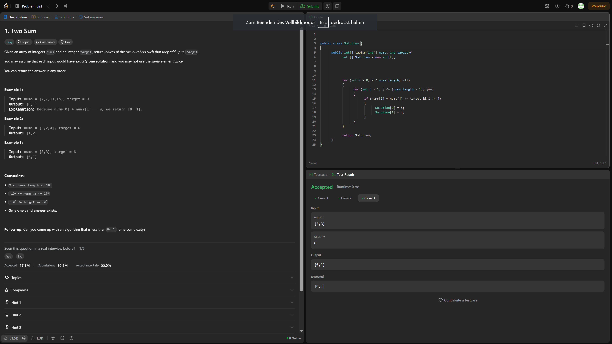

# Leetcode exercises

## Leetcode exercise 1


> Two Sum [X]  
> It returns two Values, those two Values are indexes of the Array that the method received. The indexes both show to values, and those values added are the target Integer, that is also given to the ``twoSum()`` method

**The Code: (in Solution.java)**

```java
public int[] twoSum(int[] nums, int target){
 int [] Solution = new int[2];

 for (int i = 0; i < nums.length; i++)
 {

  for (int j = 1; j <= (nums.length -1);j++)
  {
      if (nums[i] + nums[j] = =target && i != j)
      {
       Solution[0] = i;                 
       Solution[1] = j;
      }
  }

 }
            
      return Solution;
}
```

**In App.java (for Example:)**

```java

 int[] v = {3,3};
 int target = 6;
 Solution s = new Solution();

System.out.println(Arrays.toString(s.twoSum(v, target)));  

```
