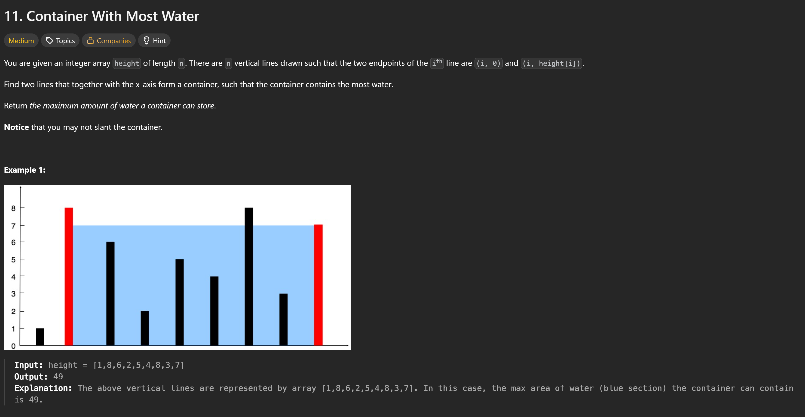

# Leetcode exercises

## Leetcode exercise 1 (Dif: Easy)


> Two Sum [X]  
> It returns two Values, those two Values are indexes of the Array that the method received. The indexes both show to values, and those values added are the target Integer, that is also given to the `twoSum()` method

**The Code (in Solution.java) :**

```java
public int[] twoSum(int[] nums, int target){
 int [] Solution = new int[2];

 for (int i = 0; i < nums.length; i++)
 {

  for (int j = 1; j <= (nums.length -1);j++)
  {
      if (nums[i] + nums[j] = =target && i != j)
      {
       Solution[0] = i;
       Solution[1] = j;
      }
  }

 }

      return Solution;
}
```

**The Code (in App.java) :**

```java

 int[] v = {3,3};
 int target = 6;
 Solution s = new Solution();

System.out.println(Arrays.toString(s.twoSum(v, target)));

```

## Leetcode Exercise 2 (Dif: Medium)


> I firstly did it wrong, because to use the Test Cases provided by Leetcode, you need to use the `ListNode.java` Class provided:

**The Code (in ListNode.java) :**

```java
public class ListNode {
 int val;
 ListNode next;
 ListNode() {}
 ListNode(int val) { this.val = val; }
 ListNode(int val, ListNode next) { this.val = val; this.next = next; }
}
```

> and I just used Linked List, which worked, the result came the same as in the test cases, but the test cases didn't work, so i made it again using the `ListNode.java` Class.  
> This is the Method using Linked List:

**The Code (in Solution.java) :**

```java
public LinkedList<Integer> addTwoNumber(LinkedList<Integer> l1 , LinkedList<Integer> l2)
      {
            //Reversing l1
            LinkedList<Integer> s1 = new LinkedList<>();
            for (int i = 0; i < l1.size(); i++)
            {
                  int one = l1.get((l1.size() - 1) - i);
                  s1.addLast(one);
            }

            //Reversing l2
            LinkedList<Integer> s2 = new LinkedList<>();
            for (int i = 0; i < l2.size(); i++)
            {
                  int one = l2.get((l2.size() - 1) - i);
                  s2.addLast(one);
            }

                  String one = "";
                  String two = "";


        LinkedList<Integer> solution = new LinkedList<>();
            if (s1.size() > s2.size())
            {

                  for (int i = 0; i < s1.size(); i++)
                  {
                    one += (s1.get(i).toString());
                    if (i < s2.size())
                    {
                        two += (s2.get(i).toString());
                    }

                  }
            }
            else if (s2.size() > s1.size())
            {
                  for (int i = 0; i < s2.size(); i++)
                  {
                    if (i < s1.size())
                    {
                        one += (s1.get(i).toString());
                    }
                    two += (s2.get(i).toString());
                  }

            }
            else{
                  for (int i = 0; i < s1.size(); i++)
                  {
                      one += (s1.get(i).toString());
                      two += (s2.get(i).toString());
                  }
            }

            int numsolv = (Integer.parseInt(one) + Integer.parseInt(two));

            String numberStr = Integer.toString(numsolv);
            int digit[] = new int[numberStr.length()];

           for (int i = 0; i < numberStr.length(); i++)
           {
            digit[i] = numberStr.charAt(i) - '0';
            solution.addFirst(digit[i]);
           }

            return solution;
      }
```

**The Code (in Solution.java) :**

```java
public ListNode addTwoNumbers(ListNode l1, ListNode l2) {

            /*
             * Summing both Values and the Carry Value
             * (if 5 + 5 = 10, then sum = 0 and carry 1)
             * carry is just sum / 10, because it is an integer,
             * the commas are ignored
             * if there is a carry, then sum should only be the first number
             * (so 6 + 6 --> sum = 2 and carry = 1)
            */
            int sum = l1.val + l2.val + carry;
            carry = sum/10; //
            if (carry >= 1) sum = sum % 10; //
            solved.next = new ListNode(sum);
            solved = solved.next;

            /*
             * Here are the recursiv Functions
             * They purpose is to take the next
             * Node (the .next Node) and
             * with that solve the sum equation and
             * adding it to the head ListNode
             * This works with the lines:
             * solved.next = new ListNode(sum);
             * solved = solved.next;
             * With solver.next the new ListNode Element
             * is also added to the header and
             * with the solved = solved.next line
             * it goes to the next Node Element
             *
             * The if statements are there to check if the
             * given List Node are Empty, and if they are, then to just use
             * a ListNode Element with the Value 0, which makes sense when it
             * comes to adding two numbers different size
             *
             * The last if statement is there to check if these
             * is still a carry, if there is
             * than it should be appended to the solution
             * via:
             * solved.next = new ListNode(carry);
             * solved = solved.next;
             *
             * than the head.next is returned, because the first value is a placeholder
             * public ListNode solved = new ListNode(0);
             * public ListNode head = solved;
             * in this hase return head would also return the 0 value, which
             * is easy avoidable by returning just head.next
             */
            if (l1.next != null && l2.next != null)
            {
                  addTwoNumbers(l1.next, l2.next);
            }
            else if (l1.next != null && l2.next == null)
            {
                  addTwoNumbers(l1.next, new ListNode(0));
            }
            else if (l1.next == null && l2.next != null)
            {
                  addTwoNumbers(new ListNode(0), l2.next);
            }
            else if (carry > 0)
            {
                  solved.next = new ListNode(carry);
                  solved = solved.next;
            }

            return head.next;
      }
```

> The most of the documentation is in the Code Comments already, it uses recursive Method calling
> to get to the next Node and saving it's value without overriding previous ones.  
> In App.Java for Test:

**The Code (in App.java) :**

```java
ListNode l1 = new ListNode(9, new ListNode(9, new ListNode(9, new ListNode(9, new ListNode(9, new ListNode(9, new ListNode(9)))))));

ListNode l2 = new ListNode(9, new ListNode(9, new ListNode (9, new ListNode(9))));

System.out.println(s.addTwoNumbers(l1, l2));
//Just to debug (It wont print anything logical)
```

> Here's an explanation of how the head and solved nodes work (because this part confused me the most):
> This Code

```java

public ListNode solved = new ListNode(0); // Startnode (Dummy)
public ListNode head = solved;            // head points to the Start of the List
```

> Then:

```java

solved.next = new ListNode(sum);

```

> ➡️ What’s happening here?

- You create a new ListNode with the value sum.

- You attach this new node to the end of the current list (i.e., to solved).

- The structure of the list has changed — head still points to the beginning, but the linked structure has been extended.

```java

solved = solved.next;

```

> ➡️ What’s happening here?

- You're just changing the reference solved.

- It no longer points to the first node but to the newly added node (new ListNode(sum)).

> But:

- head remains unchanged.

- head still points to the dummy node at the front ([0]).

> 🔍 Why doesn't head get updated?
> Because you initially made head and solved point to the same node:

```java
ListNode solved = new ListNode(0);
ListNode head = solved;
```

> After this, they both point to the same place — but as soon as you do solved = solved.next, you're changing the reference of solved to a new object.  
> This doesn't change the object that head is pointing to.

```java
ListNode solved = new ListNode(0);  // Dummy-StartNode
ListNode head = solved;             // head points to solved

solved.next = new ListNode(3);      // [0] -> [3]
solved = solved.next;              // solved points to [3]
solved.next = new ListNode(5);      // [0] -> [3] -> [5]
```

- head still points to [0].

- You can traverse the entire list starting from head, for example:

```java
while (head != null) {
    System.out.println(head.val);
    head = head.next;
}
// Output: 0 3 5

```

> 💡 Key takeaway:
> solved = solved.next moves the pointer.
> solved.next = new ListNode(...) changes the structure of the list.
> When you later work with head.next, the dummy node [0] helps you return just the actual result starting from head.next.

## Leetcode Exercise 1 with better Time Complexity O(n log n)

**The Code (in Solution.java) :**

```java
      private int pointer1;
      private int pointer2;
      private int index1;
      private int index2;
      private int[] solution = new int[2];


      public int[] twoSumEfficient(int[] nums, int target)
      {

      int[] copy = nums;
      List<Integer> list = Arrays.stream(copy).boxed().collect(Collectors.toList());
      Arrays.sort(nums);
      index1 = 0;
      index2 = nums.length - 1;
      int sum = list.get(index1) + list.get(1);
      solution[0] = 0;
      solution[1] = 1;

        if (sum != target)
        {

            while (true)
            {
                  pointer1 = nums[index1];
                  pointer2 = nums[index2];
                  sum = pointer1 + pointer2;
                  if (sum > target)
                  {
                        --index2;
                  }
                  else if (sum < target)
                  {
                        ++index1;
                  }
                  if (sum == target)
                  {
                        solution[0]= list.indexOf(pointer1);
                        solution[1] = list.lastIndexOf(pointer2);
                        return solution;

                  }
            }
        }
        else return solution;
      }

```

> It uses Pointers instead of iterating through the Array two Times (Which is the previous one with a time complexity of O(n²)). This Code transforms an Array into a List, with this List it is checked, which values are needed to be added to sum up the target, of these values the indexes are returned. This is made because the original array is being sorted, so the indexes would be wrong.

## Leetcode Exercise 3 (Dif: Medium)


**The Code (in Solution.java) :**

```java
public int[] twoSumSorted(int[] numbers, int target)
      {
            index1 = 0;
            index2 = numbers.length - 1;


            while (index1 < index2)
            {
                  pointer1 = numbers[index1];
                  pointer2 = numbers[index2];

                  int sum = pointer1 + pointer2;

                  if (sum > target) --index2;
                  else if (sum < target) ++index1;
                  else{
                        int[] sol = {index1 + 1, index2 + 1};
                        return sol;
                  }
            }
            return null;
      }
```

> Similar to the first exercise, this array is sorted, which makes it much easier to find the indexes. I used two Pointers to find the two values who summed up are equal to the target value.
> The YT Video that explains how Pointers work: [https://www.youtube.com/watch?v=4YKBwKnTnlM&t=674s](YT-Video)

## Leetcode Exercise 4 (Dif: Hard)


> Used Pointers to go through the arrays and add them to the list. Althrough it works, the Time Complexity is O(n+m) [n being the length of the first array and m the length of the second array].  
> Also used more Methods to make the Code readable

```java
public double findMedianSortedArrays(int[] nums1, int[] nums2) {
            List<Integer> SortedList = AddToSortedList(nums1, nums2);

            if (SortedList.size() % 2 == 0)
            {
                  double BeforeMedian = SortedList.get(SortedList.size()/2-1);
                  double AfterMedian = SortedList.get(SortedList.size()/2);
                  return (BeforeMedian + AfterMedian) / 2;
            }
            else{
                  int Median = SortedList.size()/2;
                  return SortedList.get(Median);
            }

      }

      public List<Integer> AddToSortedList(int[] nums1, int[] nums2)
      {
            List<Integer> SortedList = new ArrayList<>();
            index1 = 0;
            index2 = 0;

            while (true) {
             try {
                pointer1 = setPointer1(nums1, nums2);
                pointer2 = setPointer2(nums1, nums2);
                if (pointer1 == pointer2)
                {

                  if (index1 < nums1.length && index2 < nums2.length)
                  {
                        SortedList.add(pointer2);
                  }


                  index1++;
                  index2++;
                }
                else if (checkMin(pointer1, pointer2) == pointer2)
                {
                  index2++;
                }
                else if (checkMin(pointer1, pointer2) == pointer1)
                {
                  index1++;
                }
                SortedList.add(checkMin(pointer1, pointer2));

             }catch (IndexOutOfBoundsException e) {
                  return SortedList;
            }
      }

      }


      public int checkMin(int pointer1, int pointer2)
      {
            if (pointer1 < pointer2)
            {
                  return pointer1;
            }
            else if(pointer2 < pointer1)
            {
                  return pointer2;
            }
            else{
                  return pointer1;
            }
      }

      public int setPointer1(int[] nums1, int[] nums2)
      {
            if (index1 < nums1.length)
            {
                  return nums1[index1];
            }
            else{
                  return nums2[index2];
            }
      }

      public int setPointer2(int[] nums1, int[] nums2)
      {
            if (index2 < nums2.length)
            {
                  return nums2[index2];
            }
            else{
                  return nums1[index1];
            }
      }
```

- The `findMedianSortedArrays()` Method calls the `AddToSortedList()` Method with the given Arrays and finds the Median in them. The `AddToSortedList()` Method merges the Arrays into a List while still keeping the List sorted. The `checkMin()` Method checks two values and returns the smaller one. The `setPointer1()` and `setPointer2()` Method both set The Pointers to another if one Array has been already iterated through.

## Leetcode Exercise 5 (Dif: Easy)


_Problem: You have an Integer Array with duplicates, return how many unique charachters exist._

## Leetcode Exercise 6 (Dif: Medium)


_Problem: Find the Longest Palindrom in a String and return it_

Solved it usind DP (Dynamic Programming)
Solving Bigger Problems using Solutions from smaller Problems

## Leetcode Exercise 7 (Dif: Easy)


_Problem: Find occurrences of val value in a integer array and delete it, while the other values are at the left side, the right side is not important and can be whatever it can be._

Solved it using Two-Pointers and swaping the Elements and Deleting the Element val by Transforming it to -1

## Leetcode Exercise 8 (Dif: Easy)


_Problem: Find a String in a different String and give the index (Starting index) of the first occurrence, return -1 if the substring is not found_

Solved it using Two Pointers, but can be done faster (Sliding Window).

It thought it can be done better using Sliding Window, but it is slower because of the building of the sliding window.

Faster with: KMP-Algorithmus (Knuth-Morris-Pratt).

## Leetcode Exercise 9 (Dif: Medium)



auch simplet two pointer approach

Code:

```java
public int maxArea(int[] height) {
        int left = 0;
        int right = height.length - 1;
        int maxArea = 0;

        while (left < right) {
            // Berechnent aktuelle Area
            int width = right - left;
            int minHeight = Math.min(height[left], height[right]);
            int currentArea = width * minHeight;

            // Update maximum area
            maxArea = Math.max(maxArea, currentArea);

            // Bewege den Pointer mit der kleineren Höhe
            // Warum? Der kleinere limitiert die Area,
            // also probieren wir eine größere Höhe zu finden
            if (height[left] < height[right]) {
                left++;
            } else {
                right--;
            }
        }

        return maxArea;
    }

```

## Leetcode Exercis 10 (Dif: Easy)


Used a two Pointer approach, if one sign was not alphanumeric, skip the pointer on this postion to left/right and continue with the checking.

The code:

```java
    private int pointer1;
    private int pointer2;

    public boolean isPalindrome(String s) {
        String[] sArr = s.split("");
        pointer1 = 0;
        pointer2 = sArr.length - 1;

        while (pointer2 > pointer1) {
            if (!(sArr[pointer1].matches("[A-Za-z0-9]"))) {
                  pointer1++;
                  continue;
            }
            if (!(sArr[pointer2].matches("[A-Za-z0-9]"))) {
                  pointer2--;
                  continue;
            }
            if (!(sArr[pointer1].equalsIgnoreCase(sArr[pointer2]))) {
                return false;
            }
            pointer1++;
            pointer2--;
        }
        return true;
    }
```

Also used regex to check if it is alphanumeric, to check if something is alphanumeric ->

```java
      String toCheck = "1racecar1";
      boolean isalphanumeric = toCheck.matches("[A-Za-z0-9]"); // true
      boolean nonalphanumeric = "-&&".matches("[A-Za-z0-9]"); // false
```

## Leetcode Exercis 11 (Dif: Easy)


Used a two pointer approach and a sliding window, to check all posible outcomes in the window

The Code:

```java
public int maxProfit(int[] prices) {
        int buy = prices[0];
        int sell = prices[0];
        int maxProf = sell - buy;

        for (int price : prices) {
            if (price < buy) {
                buy = price;
                sell = price;
                if ((sell - buy) > maxProf) {
                    maxProf = sell - buy;
                }
            }
            if (price > sell) {
                sell = price;
                if ((sell - buy) > maxProf) {
                    maxProf = sell - buy;
                }
            }
        }

        return maxProf;
    }
```

## Leetcode Exercise 12 (Dif: Easy)

2239. Find Closest Number to Zero

> Given an integer array nums of size n, return the number with the value closest to 0 in nums. If there are multiple answers, return the number with the largest value.

> Example 1:

> Input: nums = [-4,-2,1,4,8]
> Output: 1
> Explanation:
> The distance from -4 to 0 is |-4| = 4.
> The distance from -2 to 0 is |-2| = 2.
> The distance from 1 to 0 is |1| = 1.
> The distance from 4 to 0 is |4| = 4.
> The distance from 8 to 0 is |8| = 8.
> Thus, the closest number to 0 in the array is 1.
> Example 2:

> Input: nums = [2,-1,1]
> Output: 1
> Explanation: 1 and -1 are both the closest numbers to 0, so 1 being larger is returned.

> Constraints:

> 1 <= n <= 1000
> -105 <= nums[i] <= 105

> > Code

```java
    public int findClosestNumber(int[] nums) {
        int smallest = nums[0];
        for (int num : nums) {
            if (num == 0) {
                return 0;
            } else {
                if (Math.abs(num) < Math.abs(smallest) || (num == Math.abs(smallest) && num > 0)) {
                    smallest = num;
                }
            }
        }

        return smallest;
    }
```

**Time Complexity: O(n)**

## Leetcode Exercise 13 (Dif: Easy)

1768. Merge Strings Alternately

> You are given two strings word1 and word2. Merge the strings by adding letters in alternating order, starting with word1. If a string is longer than the other, append the additional letters onto the end of the merged string.

> Return the merged string.

> Example 1:

> Input: word1 = "abc", word2 = "pqr"
> Output: "apbqcr"
> Explanation: The merged string will be merged as so:
> word1: a b c
> word2: p q r
> merged: a p b q c r
> Example 2:

> Input: word1 = "ab", word2 = "pqrs"
> Output: "apbqrs"
> Explanation: Notice that as word2 is longer, "rs" is appended to the end.
> word1: a b
> word2: p q r s
> merged: a p b q r s
> Example 3:

> Input: word1 = "abcd", word2 = "pq"
> Output: "apbqcd"
> Explanation: Notice that as word1 is longer, "cd" is appended to the end.
> word1: a b c d
> word2: p q
> merged: a p b q c d

> Constraints:

> 1 <= word1.length, word2.length <= 100
> word1 and word2 consist of lowercase English letters.

> > Code

```java
public String mergeAlternately(String word1, String word2) {
        StringBuilder merge = new StringBuilder();
        int max = Math.max(word1.length(), word2.length());
        int iterable = 0;
        while (iterable < max) {
            if (iterable < word1.length()) {
                merge.append(word1.charAt(iterable));
            }
            if (iterable < word2.length()) {
                merge.append(word2.charAt(iterable));
            }

            iterable++;
        }

        return merge.toString();
    }
```

**Time Complexity: O(n)**

## Leetcode Exercise 14 (Dif: Easy)

13. Roman to Integer

> Roman numerals are represented by seven different symbols: I, V, X, L, C, D and M.

> Symbol       Value
> I             1
> V             5
> X             10
> L             50
> C             100
> D             500
> M             1000

> For example, 2 is written as II in Roman numeral, just two ones added together. 12 is written as XII, which is simply X + II. The number 27 is written as XXVII, which is XX + V + II.

> Roman numerals are usually written largest to smallest from left to right. However, the numeral for four is not IIII. Instead, the number four is written as IV. Because the one is before the five we subtract it making four. The same principle applies to the number nine, which is written as IX. There are six instances where subtraction is used:

> I can be placed before V (5) and X (10) to make 4 and 9.
> X can be placed before L (50) and C (100) to make 40 and 90.
> C can be placed before D (500) and M (1000) to make 400 and 900.

> Given a roman numeral, convert it to an integer.

> Example 1:

> Input: s = "III"
> Output: 3
> Explanation: III = 3.

> Example 2:

> Input: s = "LVIII"
> Output: 58
> Explanation: L = 50, V= 5, III = 3.

> Example 3:

> Input: s = "MCMXCIV"
> Output: 1994
> Explanation: M = 1000, CM = 900, XC = 90 and IV = 4.

> Constraints:

> 1 <= s.length <= 15
> s contains only the characters ('I', 'V', 'X', 'L', 'C', 'D', 'M').
> It is guaranteed that s is a valid roman numeral in the range [1, 3999].

>>Code

```java
    public int romanToInt(String s) {

        HashMap<Character, Integer> Symbol = new HashMap<>();
        int result = 0;
        Symbol.put('I', 1);
        Symbol.put('V', 5);
        Symbol.put('X', 10);
        Symbol.put('L', 50);
        Symbol.put('C', 100);
        Symbol.put('D', 500);
        Symbol.put('M', 1000);

        for (int i = 0; i < s.length(); i++) {

            if ((i < s.length() - 1) && ((s.charAt(i) == 'I' && (s.charAt(i + 1) == 'V' || s.charAt(i + 1) == 'X'))
                    || (s.charAt(i) == 'X' && (s.charAt(i + 1) == 'L' || s.charAt(i + 1) == 'C'))
                    || (s.charAt(i) == 'C' && (s.charAt(i + 1) == 'D' || s.charAt(i + 1) == 'M')))) {
                result -= (int) (Symbol.get(s.charAt(i)));
            } else {
                result += (int) (Symbol.get(s.charAt(i)));
            }

        }

        return result;
    }
```

**Time Complexity: O(n)**

## Leetcode Exercise 15 (Dif: Easy)

392. Is Subsequence

> Given two strings s and t, return true if s is a subsequence of t, or false otherwise.

> A subsequence of a string is a new string that is formed from the original string by deleting some (can be none) of the characters without disturbing the relative positions of the remaining characters. (i.e., "ace" is a subsequence of "abcde" while "aec" is not).

> Example 1:

> Input: s = "abc", t = "ahbgdc"
> Output: true

> Example 2:

> Input: s = "axc", t = "ahbgdc"
> Output: false

> Constraints:

> 0 <= s.length <= 100
> 0 <= t.length <= 10^4
> s and t consist only of lowercase English letters.

>>Code

```java
    public boolean isSubsequence(String s, String t) {
        int i = 0;
        StringBuilder sRemover = new StringBuilder(s);
        while (i < t.length() && s.length() != 0) {
            if (s.charAt(0) == t.charAt(i)) {
                sRemover.deleteCharAt(0);
                s = sRemover.toString();
            }
            i++;
        }
        return s.length() == 0;
    }
```

**Time Complexity: O(n)**

## Leetcode Exercise 16 (Dif: Easy)

14. Longest Common Prefix

> Write a function to find the longest common prefix string amongst an array of strings.
> If there is no common prefix, return an empty string "".

> Example 1:

> Input: strs = ["flower","flow","flight"]
> Output: "fl"

> Example 2:

> Input: strs = ["dog","racecar","car"]
> Output: ""
> Explanation: There is no common prefix among the input strings.

> Constraints:

> 1 <= strs.length <= 200
> 0 <= strs[i].length <= 200
> strs[i] consists of only lowercase English letters.

>>Code

```java
    public String longestCommonPrefix(String[] strs) {
        String word = strs[0];
        for (String s : strs) {
            int i = 0;
            if (s.isEmpty()) {
                return "";
            }
            while (i < word.length()) {
                try {
                    if (word.charAt(i) != s.charAt(i)) {
                        word = word.substring(0, i);
                    }
                } catch (Exception e) {
                    word = word.substring(0, i);
                }
                i++;
            }
        }
        return word;
    }
```

**Time Complexity: O(S)** where S is the sum of all characters in all strings


